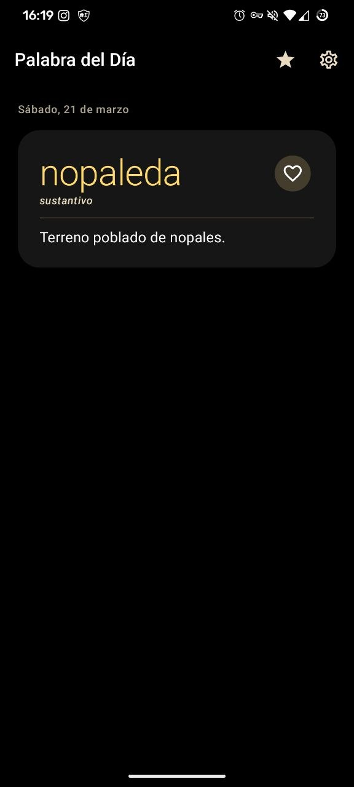
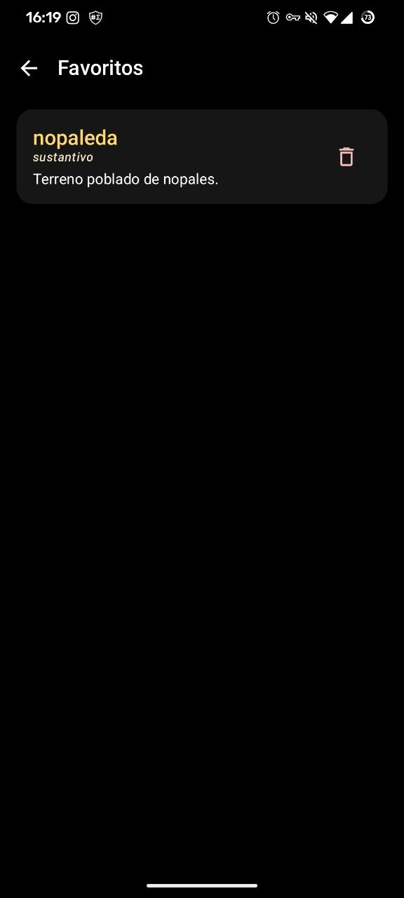
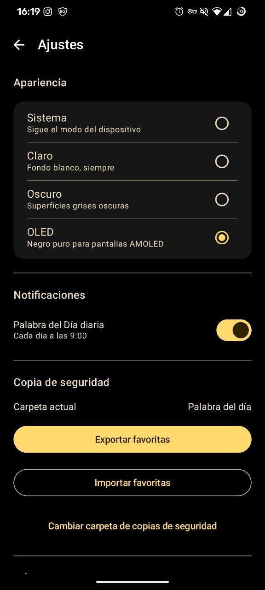

<div align="center">


# Palabra de Hoy

[](https://github.com/cuyo-pixel/palabradehoy/releases)
[](https://developer.android.com/about/versions/10)
[](LICENSE)
[](https://kotlinlang.org)
[](#)
[](https://ko-fi.com/cuyopixel)

</div>

---

**[Español](#español)** · **[English](#english)**

---

## Español

*Tu palabra del español de hoy. Sin conexión, sin anuncios, sin rastreo.*

### Capturas

<div align="center">

&nbsp;

&nbsp;

</div>

### Características

- Palabra diferente cada día, la misma para todos los usuarios
- Definición completa con categoría gramatical
- Guarda palabras favoritas y expórtalas / impórtalas como JSON
- Notificación diaria opcional a las 9:00
- Temas: Sistema, Claro, Oscuro, OLED (negro puro)
- Material You en Android 12+, icono monocromo en Android 13+
- Sin permiso de internet — diccionario integrado en la app

### Compilar desde código fuente

El diccionario (`app/src/main/assets/dictionary.json`) está incluido en el
repositorio, no hace falta ningún paso extra antes de compilar.

```bash
git clone https://github.com/cuyo-pixel/palabradehoy.git
cd palabradehoy
./gradlew assembleDebug
```


### Datos del diccionario

El diccionario incluido se genera a partir de
[eneko98/RAE-Corpus](https://github.com/eneko98/RAE-Corpus), una recopilación
comunitaria basada en contenido de la Real Academia Española. Este proyecto no
tiene fines comerciales, es de código abierto y no tiene ninguna vinculación
con la RAE.

---

## English

*Your Spanish word of the day. Offline, ad-free, no tracking.*

### Features

- A different word every day, the same for all users worldwide
- Full definition with grammatical category
- Save favourites and export / import them as a JSON backup file
- Optional daily notification at 09:00
- Four themes: System, Light, Dark, OLED (true black)
- Material You dynamic colour on Android 12+
- Themed monochrome icon on Android 13+
- No internet permission — dictionary fully bundled

### Building from source

**Requirements**

| Tool | Minimum version |
|------|----------------|
| JDK  | 17 |
| Android SDK | API 29 |
| Gradle | 8.11.1 (wrapper included) |

The dictionary asset (`app/src/main/assets/dictionary.json`) is included in
the repository, so no extra steps are needed before building.

```bash
git clone https://github.com/cuyo-pixel/palabradehoy.git
cd palabradehoy
./gradlew assembleDebug
```


### Project structure

```
app/src/main/
├── assets/
│   └── dictionary.json          # pre-generated, included in repo
├── kotlin/com/palabradeldia/
│   ├── data/                    # Room, DataStore, DictionaryLoader
│   ├── di/                      # Hilt modules
│   ├── domain/                  # models, repository interface, use cases
│   ├── notification/            # NotificationScheduler
│   ├── presentation/            # Compose screens, ViewModels, Navigation
│   ├── util/                    # DailyWordSelector
│   └── worker/                  # DailyWordWorker (WorkManager)
└── res/                         # themes, drawables, strings
```

### Daily word algorithm

Each calendar date maps to a dictionary index via a Fisher-Yates shuffle
seeded from the year (`year × 1_000_003`, Knuth MMIX LCG). The same date
always returns the same word on every device, with no repetition within a
calendar year.

### Dictionary data

Generated from [eneko98/RAE-Corpus](https://github.com/eneko98/RAE-Corpus),
a community-compiled dataset based on content from the Real Academia Española.
Non-commercial, open source, not affiliated with the RAE.

### Tech stack

| Layer | Libraries |
|-------|-----------|
| UI | Jetpack Compose · Material 3 |
| Architecture | Clean Architecture · MVVM |
| DI | Hilt |
| Database | Room |
| Preferences | DataStore |
| Background | WorkManager |
| Serialisation | kotlinx.serialization |

### License

MIT — see [LICENSE](LICENSE).

---

<div align="center">

**App by [Cuyo Pixel](https://github.com/cuyo-pixel)**

<sub>
The author designed and built this application, making all product and
technical decisions. Claude Sonnet (Anthropic) assisted with documentation and
build automation.
</sub>

</div>
